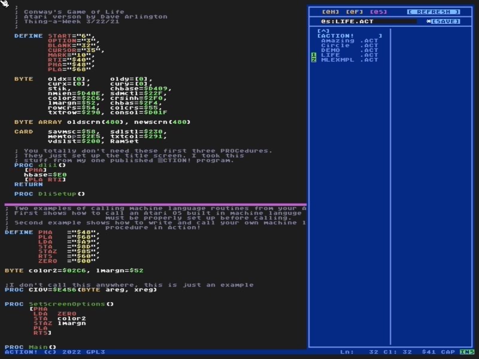

# Action! Programming Language

*From Wikipedia...*

**Action!** is a procedural programming language and integrated development environment written by Clinton Parker for the Atari 8-bit family. The language, which is similar to ALGOL, compiled to high-performance code for the MOS Technologies 6502 of the Atari computers.

The assembly language source code for Action! was made available under the GNU General Public License by the author in 2015.

---

This requires [64tass](https://sourceforge.net/projects/tass64/) to assemble from source.

---

The **f256jr** code branch contains a port for the 65c02-based [Foenix Retro Systems](https://c256foenix.com/) platform.

The **foenix** code branch contains a port for the 65816-based [Foenix Retro Systems](https://c256foenix.com/) platform.

## Language Enhancements

Larger text window area

Syntax Highlighting

Overlay Panels
